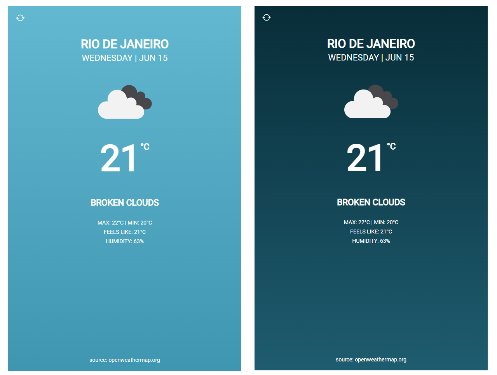

# vue3-weather

- Vue.js 3x
- Vite
- Vue-router
- Pinia
- Axios
- SCSS
----



----

Weather source: https://openweathermap.org/
Open Weather Map API Key variable imported in a .env file (VITE_APIKEY)

----

## Project Setup

```sh
npm install
```

### Compile and Hot-Reload for Development

```sh
npm run dev
```

### Compile and Minify for Production

```sh
npm run build
```

### Lint with [ESLint](https://eslint.org/)

```sh
npm run lint
```
